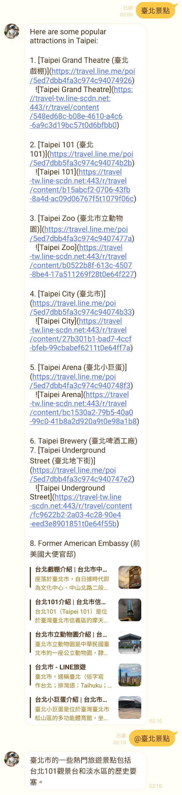

# openai_agent_linebot
A Line Bot with Open AI API and agent
 : [line.me/R/ti/p/@811saehr](https://line.me/R/ti/p/@811saehr)

# Function
* 提示

* RAG

* 天氣

* 股票

* 購物

* 旅遊

# Reference
* [Jung217 / groq_line_bot](https://github.com/Jung217/groq_line_bot)

* [Jung217 / Penguin-cat-assistant](https://github.com/Jung217/Penguin-cat-assistant)

* [kkdai / langchain_tools](https://github.com/kkdai/langchain_tools/tree/master)
